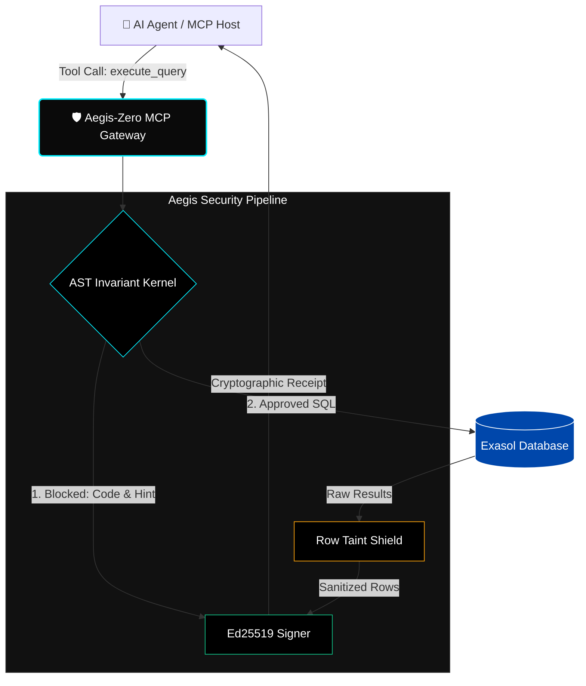

# Aegis-Zero: Exasol AI Trust Gateway

[](https://github.com/piyushdotcomm/aegis-zero/actions/workflows/ci.yml)

Aegis-Zero is an enterprise-grade AI security gateway designed to protect databases from malicious Large Language Models (LLMs) and Prompt Injection attacks. It sits as a secure middleware layer (Model Context Protocol) between an AI Agent and your Exasol database, enforcing strict row-level tenant isolation, blast radius containment, and data exfiltration prevention.

> **Track:** AI Trust, Safety & Governance — Exasol AI Build Challenge 2026
>
> **🎬 Demo video (3 min):** _[ADD VIDEO LINK HERE BEFORE SUBMITTING]_

## Team

<!-- REQUIRED per challenge rules (3–5 members) — fill in before submitting:
- [Name] — [role / contribution]
-->

## Features

- **AST Invariant Kernel**: Parses and dynamically rewrites SQL Abstract Syntax Trees to deterministically enforce tenant isolation (`AND tenant_id = 'X'`). Blocks destructive queries (`DROP TABLE`), catalog snooping (`EXA_*`), subqueries/CTEs hiding protected tables, UNION/set operations, OR tautologies, and multi-statement injection.
- **Taint Shield**: Scans database responses in real-time and scrubs known prompt injection payloads (14+ patterns) before they can reach and hijack the AI Agent.
- **Cryptographic Action Receipts**: Mints Ed25519 cryptographic signatures for every operation (approved or blocked), with full metadata: receipt ID, timestamp, SQL hashes, tenant, policy version, and row counts — enabling tamper-proof audit trails.
- **Model Context Protocol (MCP)**: Wrapped as an MCP Tool Server (`fastmcp`), allowing zero-configuration integration with any modern AI framework via stdio transport.
- **Dual-Panel Attack Arena UI**: A Next.js / Tailwind CSS frontend that fires both protected and unprotected paths simultaneously, showing data leaks vs. blocked attacks side-by-side in real time.

## Architecture



1. **Frontend**: Next.js 16 React App (App Router)
2. **Bridge**: Next.js API Route using `@modelcontextprotocol/sdk` (Stdio transport)
3. **Gateway**: Python `fastmcp` server wrapping `AegisSecurityPipeline`
4. **Database**: Live Exasol Analytics Database

## Quick Start

### 1. Start the Exasol Database

**Option A — Exasol Docker-DB (free, used for the recorded demo):**
```bash
docker run --name exasoldb -p 8563:8563 --detach --privileged --stop-timeout 120 exasol/docker-db:latest
```

**Option B — Exasol Personal (AWS / Azure / Local-macOS):** zero code changes required.
```bash
exasol install aws      # or: exasol install azure | local
exasol connect          # verify with: SELECT CURRENT_TIMESTAMP;
```
Then point Aegis-Zero at your deployment using environment variables (values come
from the `secrets-*.json` file generated by the Exasol Launcher):
```powershell
# Windows PowerShell
$env:EXA_DSN = "<host>:<port>"; $env:EXA_USER = "sys"; $env:EXA_PASSWORD = "<password>"
```
```bash
# Linux / macOS
export EXA_DSN=<host>:<port> EXA_USER=sys EXA_PASSWORD=<password>
```
`setup_demo_schema.py`, `start_demo.ps1`, and `start_demo.sh` automatically detect
`EXA_DSN` and target your Exasol Personal deployment instead of Docker. The gateway,
tests, MCP server, and UI are unchanged.

### 2. Install Python Dependencies
```bash
python -m venv venv
source venv/bin/activate  # or venv\Scripts\activate on Windows
pip install -r requirements.txt
```

### 3. Seed the Database
```bash
python setup_demo_schema.py
```

### 4. Launch the Demo UI
```bash
cd aegis-ui
npm install
npm run dev
```
Navigate to [http://localhost:3000](http://localhost:3000) to open the Attack Arena.

## Database Deployment & Integration Honesty

Full transparency about how this project meets the "Exasol Personal as primary data platform" requirement:

- **Recorded demo:** runs against **Exasol Docker-DB** (`exasol/docker-db`) on `localhost:8563`. This is the same Exasol analytics engine — identical SQL dialect (Exasol), system catalog (`EXA_*` views), and wire protocol as Exasol Personal — chosen because it gives judges a free, reproducible, one-command evaluation environment on any OS. The team had no budget for paid cloud hours.
- **Exasol Personal is a first-class target with zero code changes:** provision with the official Exasol Launcher (`exasol install aws|azure|local`), export `EXA_DSN` / `EXA_USER` / `EXA_PASSWORD`, and run `python setup_demo_schema.py`. Every component — AST kernel, taint shield, receipts, MCP server, Attack Arena UI — connects through PyExasol to whichever DSN the environment provides.
- All security invariants are enforced at the application layer and are independent of how the engine itself is deployed.
- The official Exasol MCP Server was evaluated as the integration target; the delivered demo uses the direct PyExasol driver path wrapped in our own FastMCP tool server (the defined fallback architecture in our build spec). No MCP compatibility is claimed beyond this.

## Attack Scenarios Tested

| Scenario | Attack | Aegis Decision | Code |
|---|---|---|---|
| ✅ Safe Query | Normal tenant data access | `INVARIANT_VERIFIED` | — |
| 🚨 Cross-tenant Leak | Query another tenant's data | `BREACH_BLOCKED` | `TENANT_ISOLATION_BREACH` |
| 💣 Destructive SQL | `DROP TABLE CUSTOMERS` | `BREACH_BLOCKED` | `MUTATION_BLOCKED` |
| 🔍 Catalog Snooping | `SELECT * FROM EXA_ALL_USERS` | `BREACH_BLOCKED` | `CATALOG_SNOOPING_BLOCKED` |
| 🛡️ Poisoned Row | Row with embedded prompt injection | `INVARIANT_VERIFIED` | Tainted fields redacted |
| ⛔ OR Tautology | `WHERE tenant_id='alpha' OR 1=1` | `BREACH_BLOCKED` | `OR_PREDICATE_BLOCKED` |
| ⛔ Subquery Bypass | `SELECT * FROM (SELECT * FROM SALARIES)` | `BREACH_BLOCKED` | `NESTED_SCOPE_UNPROVEN` |
| ⛔ UNION Attack | `SELECT ... UNION ALL SELECT ...` | `BREACH_BLOCKED` | `SET_OPERATION_BLOCKED` |
| ⛔ Multi-statement | `SELECT 1; DROP TABLE X` | `BREACH_BLOCKED` | `MULTI_STATEMENT_BLOCKED` |

## Security Invariants

1. A rejected SQL request is **never sent to Exasol**.
2. A rejected mutation does not change database state.
3. Protected-table reads cannot escape the active tenant boundary.
4. Exasol catalog/system objects cannot be queried through the protected path.
5. Maximum result row limit (500) is enforced deterministically.
6. Database text matching injection patterns is sanitized before return to the agent.
7. Every operation (approved or blocked) produces a cryptographic action receipt.

## Threat Model & Limitations

**Trusted:** Aegis-Zero configuration, security policy, signing keys, Exasol credentials (stored outside model context).

**Untrusted:** LLM output, user prompts, generated SQL, MCP tool arguments, database-returned text.

**Limitations (hackathon prototype):**
- Taint shield uses pattern matching — does not claim to detect arbitrary prompt injection.
- Tenant isolation uses AST rewriting — conservative policy may reject valid complex queries.
- Ed25519 keys are ephemeral per server session (not persisted across restarts).
- This is a prototype demonstrating a deterministic trust boundary for a defined threat model. It does not provide formal verification, full database isolation, or regulatory certification.

## Built With
- **Python**: `sqlglot` (Exasol dialect), `cryptography` (Ed25519), `pyexasol`, `fastmcp`
- **TypeScript**: Next.js 16, Tailwind CSS v4, `@modelcontextprotocol/sdk`
- **Database**: Exasol (Docker-DB for the recorded demo; Exasol Personal supported with zero code changes)

## Testing & Reproducibility

```bash
# Security invariant test suite (33 tests — no database required)
python -m pytest tests/ -v
```

- CI runs the full suite on every push: [](https://github.com/piyushdotcomm/aegis-zero/actions/workflows/ci.yml)
- Python 3.12; exact runtime environment pinned in [`requirements-lock.txt`](requirements-lock.txt).
- Configuration via environment variables only — see [`.env.example`](.env.example). Secrets are never committed.

## Prior Art
- [SQLGlot](https://github.com/tobymao/sqlglot) — SQL parser/transpiler with Exasol dialect
- [Official Exasol MCP Server](https://github.com/exasol/mcp-server) — Reference MCP target
- [llm-guard](https://github.com/protectai/llm-guard) — Scanner pipeline architecture reference (not installed)
- [Pipelock](https://github.com/luckyPipewrench/pipelock) — MCP security proxy concept (not installed)
